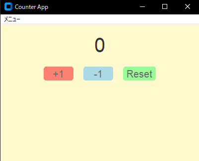

# カウンターアプリ
## CustomTkinterを使用したカウントアプリケーション
簡易カウント用アプリケーション

## 実行イメージ
### 実行画面

## できること
- 数字のカウント(+1,-1,リセット)

## 使用技術
- Python
- Custom Tkinter
- Tkinter

## 環境
- Python 3.10 以上(pyファイル)
- Windows(exeファイル)

## 起動及び使用手順
main.exeファイルの実行(windowsのみ)  

もしくはコマンドプロンプト(対象ディレクトリ下)で以下コマンドを実行  
python main.py(python環境必須)  

## フォルダ構成

フォルダ構成(折り畳み)  

counter/  
├─build(build及びdistはexeファイル作成時に自動生成)  
├─dist  
│  └─main.exe  
├─docs  
│  └─01_count.png (実行時のスクリーンショット各種)  
│  └icon_01.clip(変換前iconファイル)  
│  └icon_01.png(同上)  
├ main.py  
└ icon_01.ico  
└ README.md  

## 簡易設計

簡易設計(折り畳み)  

main.py  
	∟init(初期化)  
	∟create_main_frame(初期画面)	
	∟plus(加算)  
	∟minus(減算)  
	∟reset(リセット)  

## 簡易テスト
### ■正常系
- +1ボタン押下 → カウンターの数字が加算される
- -1ボタン押下 → カウンターの数字が減算される
- リセットボタン押下 → カウンターの数字がリセットされ0になる

### ■境界・特殊ケース
- +1ボタンでの加算2桁 → 加算確認  
- +1ボタンでの加算3桁 → 加算確認  
- -1ボタンでの減産2桁 → 減算確認  
- -1ボタンでの減産3桁 → 減算確認  

## version履歴
- v1.0.0(2026-04-03)  
	初回リリース  

## 備考
本ツールは個人開発アプリです。  

## 今後の改善
今の所予定はありません。  