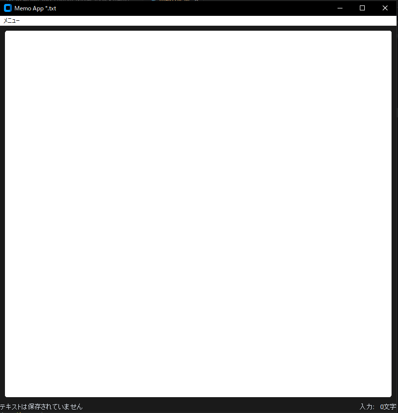

# memoアプリ
## CustomTkinterを使用したメモ帳ツール
簡易メモ帳ツール      

## 実行イメージ
### 実行画面

.png)
.png)
.png)

## できること
- テキストエリアへの書き込み  
- 名前を付けて保存、ファイルを開く、上書き保存  

## 使用技術
- Python
- Custom Tkinter
- Tkinter

## 環境
- Python 3.10 以上(pyファイル)
- Windows(exeファイル)

## 起動及び使用手順
main.exeファイルの実行
もしくはコマンドプロンプト(プロジェクトルート)で以下コマンドを実行  
python -m apps.memo.main  

※python -m はPythonモジュールをスクリプト(実行用ファイル)として実行するためのコマンドラインオプション  

## フォルダ構成

フォルダ構成(折り畳み)  

apps  
├─memo/  
│		├─build(build及びdistはexeファイル作成時に自動生成)  
│		├─dist  
│		│  └─main.exe  
│		├─docs  
│		│  └01_memo.png (実行時のスクリーンショット各種)  
│		│  └02_ ...  
│		│  └icon_01.clip(変換前iconファイル)  
│		│  └icon_01.png(同上)  
│		├ main.py  
│		└ icon_01.ico  
│		└ README.md  
common  
└─共通処理用ディレクトリ  

## 簡易設計

簡易設計(折り畳み)  

main.py  
	∟init(初期化)  
	∟create_main_frame(初期画面)  
	∟save_file(名前を付けて保存)  
	∟update_file(上書き保存)  
	∟import_file(ファイルを開く)  
	∟monitoring_text(キーボードから入力があった時、文字列カウントを行う)  
	∟textbox_count(テキストボックスに入力されている文字数のカウント)  
	∟clear(テキストボックス及び読み込んだファイルパスのクリア)  
	∟close_memo(ツールを閉じる確認処理)  

## 簡易テスト
### ■正常系
- テキストボックスに入力→メニューからファイルへ保存
- メニューからファイルを開く→テキストボックスにファイルの内容が表示
- 既存ファイルを開き、追加で書き込み→メニューから上書き保存を行いファイルが更新される
- テキストがない状態で終了→そのまま終了
- テキストがあり克保存している→保存せず終了
- テキストがあり保存していない→キャンセル→ダイアログを閉じ、アプリに戻る  
- テキストがあり保存していない→はい→既存ファイルなら上書き処理を行い終了  
- テキストがあり保存していない→はい→既存ファイルではないならファイルダイアログを開く→保存した場合その後終了、保存しなかった場合アプリに戻る  
- テキストがあり保存していない→いいえ→そのまま終了  

### ■境界・特殊ケース
- ショートカットでの名前を付けて保存→ファイルダイアログが表示
- ショートカットでの上書き保存→ファイルダイアログ非表示、対象ファイルが更新される

## version履歴
- v1.0.0(2026-04-04)  
	初回リリース  
- v1.2.0(2026-04-05)  
  テキストボックス下部に文字数カウント及び保存状況を追加  
	終了時に確認処理を追加  
	メニューにクリア処理を追加  

## 備考
本ツールは個人開発アプリです。  

## 今後の改善案
- Undo/Redo
- ステータスバー(画面下部に総文字数/未保存/保存済みの表示)
- クリア機能(ボタン実装は考え中)
