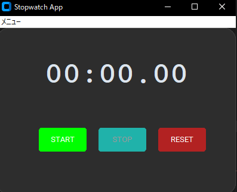

# Stopwatchアプリ
## CustomTkinterを使用したストップウォッチ
簡易ストップウォッチ

## 実行イメージ
### 実行画面

## できること
- 1ミリ秒～59分間の経過時間を計測(任意でストップ可能)

## 使用技術
- Python
- Custom Tkinter
- Tkinter

## 環境
- Python 3.10 以上(pyファイル)
- Windows(exeファイル)

## 起動及び使用手順
main.exeファイルの実行
もしくはコマンドプロンプト(プロジェクトルート)で以下コマンドを実行  
python -m apps.merge_files.main  

※python -m はPythonモジュールをスクリプト(実行用ファイル)として実行するためのコマンドラインオプション  

## フォルダ構成

フォルダ構成(折り畳み)  

apps  
├─stopwatch/  
│		├─build(build及びdistはexeファイル作成時に自動生成)  
│		├─dist  
│		│  └─main.exe  
│		├─docs  
│		│  └─01_stopwatch.png (実行時のスクリーンショット各種)  
│		│  └icon_01.clip(変換前iconファイル)  
│		│  └icon_01.png(同上)  
│		├ main.py  
│		└ icon_01.ico  
│		└ README.md  
common  
└─共通処理用ディレクトリ  

## 簡易設計

簡易設計(折り畳み)  

main.py  
	∟init(初期化)  
	∟create_widgets(初期画面)	
	∟update_time(タイムの更新処理。afterによりstartを押した間10ミリ秒毎に更新を行う)  
	∟start(開始時間を取得し、update_timeを実行)  
	∟stop(今までの経過時間を取得し、after_cancelでupdate_timeの処理を止める)  
	∟reset(開始時間及び、経過時間を初期化)  
	∟toggle_buttons(start及びstopボタン押下時にボタンの有効化/無効化を切り替える)  

## 簡易テスト
### ■正常系
- STARTボタン押下 → ストップウォッチ開始
- ストップウォッチ稼働時STOPボタン押下 → ストップウォッチ停止
- ストップウォッチ稼働時RESRTボタン押下 → ストップウォッチがリセットされ00:00:00になる
- ストップウォッチの記録がある状態でRESRTボタン押下 → ストップウォッチがリセットされ00:00:00になる

### ■境界・特殊ケース
- STARTボタンを連打 → ストップウォッチ稼働時には押せないことを確認  
- STOPボタンを連打 → ストップウォッチ停止時には押せないことを確認  

## version履歴
- v1.0.0(2026-04-03)  
	初回リリース  

## 備考
本ツールは個人開発アプリです。  

## 今後の改善案
- ラップタイム機能。RESET横にLAPボタンを追加し、その時のタイムを下に表示する  
- 色の変化。実行中は背景を明るくし、停止中は暗くする等視覚的なフィードバックを入れる  