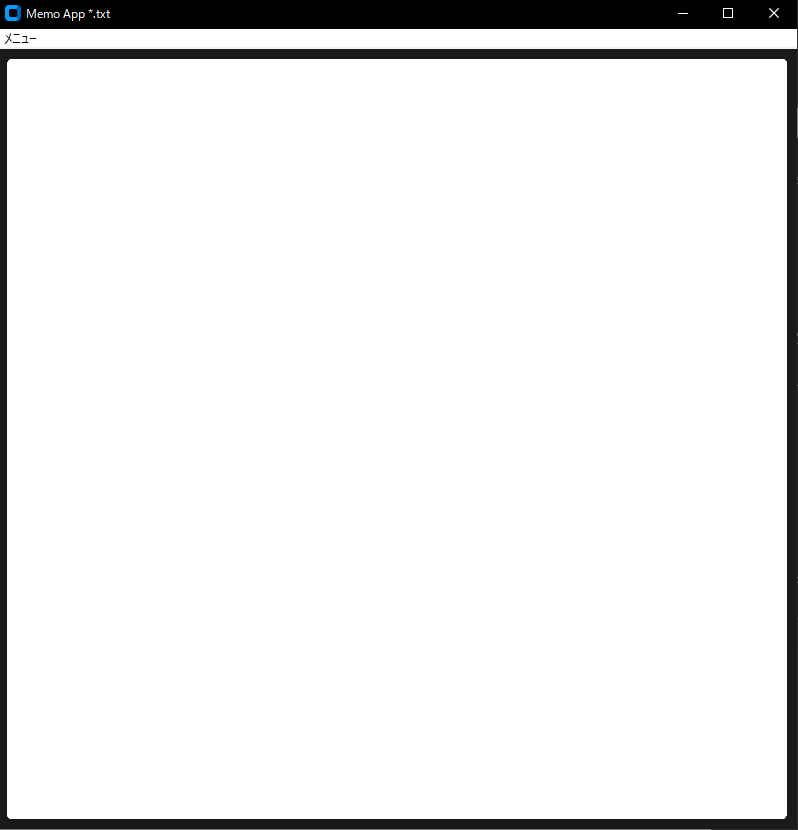

# memoアプリ
## tkinterを使用したメモ帳ツール
簡易メモ帳ツール      

## 実行イメージ
### 実行画面

.png)

## できること
- テキストエリアへの書き込み  
- 名前を付けて保存、ファイルを開く、上書き保存  

## 使用技術
- Python
- Custom Tkinter
- Tkinter

## 環境
- Python 3.10 以上(pyファイル)
- Windows(exeファイル)

## 起動及び使用手順
main.exeファイルの実行(windowsのみ)  
もしくはコマンドプロンプト(対象ディレクトリ下)で以下コマンドを実行
python main.py(python環境必須)  

## フォルダ構成

フォルダ構成(折り畳み)  

memo/  
├─build(build及びdistはexeファイル作成時に自動生成)  
├─dist  
│  └─main.exe  
├─docs  
│  └01_memo.png (実行時のスクリーンショット各種)  
│  └02_ ...  
│  └icon_01.clip(変換前iconファイル)  
│  └icon_01.png(同上)  
├ main.py  
└ icon_01.ico  
└ README.md  

## 簡易設計

簡易設計(折り畳み)  

main.py  
	∟init(初期化)  
	∟create_main_frame(初期画面)  
	∟save_file(名前を付けて保存)  
	∟update_file(上書き保存)  
	∟import_file(ファイルを開く)  

## 簡易テスト
### ■正常系
- テキストボックスに入力→メニューからファイルへ保存
- メニューからファイルを開く→テキストボックスにファイルの内容が表示
- 既存ファイルを開き、追加で書き込み→メニューから上書き保存を行いファイルが更新される

### ■境界・特殊ケース
- ショートカットでの名前を付けて保存→ファイルダイアログが表示
- ショートカットでの上書き保存→ファイルダイアログ非表示、対象ファイルが更新される

## version履歴
- v1.0.0(2026-04-04)  
	初回リリース  

## 備考
本ツールは個人開発アプリです。  

## 今後の改善案
- Undo/Redo
- ステータスバー(画面下部に総文字数/未保存/保存済みの表示)
- クリア機能(ボタン実装は考え中)
